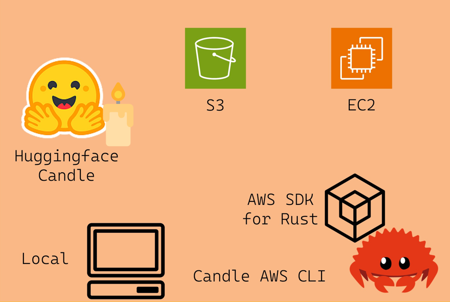

# AWS Candle CLI Tool

A Rust CLI tool to support [Candle Cookbook](https://github.com/nogibjj/candle-cookbook/tree/main) on AWS built using the [AWS SDK for Rust](https://github.com/awslabs/aws-sdk-rust) 



Jump to:
* [Setup](#setup)
* [CLI Commands](#cli-commands)
* [Model Sources](#model-sources)

## Setup

1. Configure an [EC2 instance](https://aws.amazon.com/ec2/instance-types/) depending on your model target and memory requirements. For a GPU Deep Learning enabled instance follow the [Hello, Candle on AWS! tutorial](https://nogibjj.github.io/candle-cookbook/aws/hello-aws.html)

2. Create an AWS IAM User Policy "Candle-Cli" with `AmazonS3FullAccess` and `AmazonEC2FullAccess` permissions

3. Create an access key for your "Candle-Cli" user

4. Create `.env` file and configure with AWS credentials and EC2 Key Pair

```
# $touch .env
AWS_ACCESS_KEY_ID=<YOUR_ACCESS_KEY>
AWS_SECRET_ACCESS_KEY=<YOUR_ACCESS_SECRET>
AWS_DEFAULT_REGION=<YOUR_AWS_REGION>
EC2_KEY=PATH/TO/EC2_KEY_PAIR.pem
```

## CLI Commands

### List Resources

Args:
* --s3 ~ flag to list s3 resources
* --ec2 ~ flag to list ec2 resources and status
```
# To list simultaneously
$ cargo run list --s3 --ec2
```


### EC2 Instance Actions

Args:
* --id ~ instance id
* --action:
    * start: start instance
    * stop: stop instance
    * endpoint: get public endpoint
```
$ cargo run instance --id <INSTANCE_ID> --action <start|stop|endpoint>
```


### SSH Connect to EC2 Instance

Quick Tip: first run `cargo run list --ec2` to confirm instance is running!

Args:
* --id ~ instance id
* --mnt ~ mount local model directory to EC2 on launch

```
$ cargo run connect --id <INSTANCE_ID>

# To remove mount dir to free up memory
ubuntu@ip$ rm -r <MNT_DIR>

# To close SSH tunnel
ubuntu@ip$ exit

# Make sure to stop your EC2 instance to avoid charges
$ cargo run instance --id <INSTANCE_ID> --action stop
```


### S3 Bucket Actions

Args:
* --name ~ bucket name
* --action:
    * list: list objects in the bucket
    * create: create new bucket with name --name
    * delete: delete bucket with name --name
```
$ cargo run bucket --name <BUCKET_NAME> --action <list|create|delete>
```


### S3 Object Actions

Args
* --bucket ~ bucket name -- NB: Will create bucket if DNE
* --key ~ object key or path/to/file for --action upload
* --action:
    * upload: upload local file as bucket object
    * delete: delete object with key --key
    * get: download object with key --key to ./root

```
$ cargo run object --bucket <bucket_name> --key <object_key> --action <upload|delete|get>"
# ex: cargo run object --bucket my-bucket --key ./test/test.png --action upload
# ex: cargo run object --bucket my-bucket --key test.png --action get
```

## Model Sources

The AWS Candle CLI is intended to support multiple workflows for building and executing Candle binaries.

**Note:** The first execution of a binary may take a while to run as the files have to be collected. Subsequent runs should execute much faster.

* [Build and run binaries on EC2](#build-and-run-binaries-on-ec2)
* [Mount local binary directory to EC2](#mount-local-binary-directory-to-ec2)
* [Copy your S3 model objects to EC2](#copy-your-s3-models-to-ec2)
* [Download prebuilt model binaries](#download-prebuilt-binaries)

### Build and run binaries on EC2

1. Complete the [Hello, Candle on AWS](https://nogibjj.github.io/candle-cookbook/aws/hello-aws.html) or [CodePipeline + Jenkins](https://nogibjj.github.io/candle-cookbook/aws/jenkins-pipeline.html) tutorials to build binaries on your EC2 instance.

**Note:** You can replace skip the "Connect to EC2 via SSH" step and connect through the CLI tool instead!

```
# List your EC2 instances
$ cargo run list --ec2

# Connect to EC2
$ cargo run instance --id <INSTANCE_ID> --action start
$ cargo run connect --id <INSTANCE_ID>

# Complete https://nogibjj.github.io/candle-cookbook/aws/hello-aws.html tutorial
# Remember to skip the "Connect to EC2 via SSH" step

# Instantly run models from the remote EC2 terminal
ubuntu@ip$ ./quantized --prompt "who invented the lightbulb"

# Exit the SSH
ubuntu@ip$ exit

# Stop your instance
cargo run instance --id <INSTANCE_ID> --action stop
```

### Mount local binary directory to EC2

You can mount a local directory of model binaries when you connect to your EC2 instance with the `--mnt` flag

```
# List your EC2 instances
$ cargo run list --ec2

# Connect to your EC2 instance + mount local model directory
$ cargo run connect --id <INSTANCE_ID> --mnt <PATH/TO/MNT_DIR>

# To remove mount dir to free up memory
ubuntu@ip$ rm -r <MNT_DIR>

# Exit SSH
ubuntu@ip$ exit

# Stop your instance
cargo run instance --id <INSTANCE_ID> --action stop
```

**Note:** You can build Candle binaries locally by following the [Hello, Candle! tutorial](https://nogibjj.github.io/candle-cookbook/local/hello-candle.html).


### Copy your S3 models to EC2

If you have Candle binaries stored as S3 objects or artifacts -- like if you completed the [Hello, Candle on AWS!](https://nogibjj.github.io/candle-cookbook/aws/hello-aws.html) -- then you can copy them across to your EC2 instance.

**Note:** Ensure your EC2 is configured with IAM User Role with `AmazonFullS3Access` like in [Hello, Candle on AWS!](https://nogibjj.github.io/candle-cookbook/aws/hello-aws.html)

```
# List your S3 buckets and EC2 instances
$ cargo run list --s3 --ec2

# List your S3 objects
$ cargo run bucket --name <BUCKET_NAME> --action list

# Connect to EC2
$ cargo run instance --id <INSTANCE_ID> --action start
$ cargo run connect --id <INSTANCE_ID>

# Check AWS CLI is installed
ubuntu@ip$ aws --version

# If not install AWS CLI
ubuntu@ip$ curl "https://awscli.amazonaws.com/awscli-exe-linux-x86_64.zip" -o "awscliv2.zip"
ubuntu@ip$ unzip awscliv2.zip
ubuntu@ip$ sudo ./aws/install
ubuntu@ip$ rm -r awscliv2.zip

# Check install
ubuntu@ip$ aws --version

# Copy individual models from S3 to EC2
ubuntu@ip$ aws s3 cp s3://MY_BUCKET/model .

# Copy the entire bucket of model objects/artifacts from S3 to EC2
ubuntu@ip$ aws s3 sync s3://MY_BUCKET .

# Exit the SSH
ubuntu@ip$ exit

# Stop your instance
cargo run instance --id <INSTANCE_ID> --action stop
```

### Download prebuilt binaries

Once connected to EC2 you can download run any of the prebuilt binaries available [here](https://github.com/athletedecoded/cookbook-binaries/tree/main/binaries). Make sure to run `chmod +x` to give EC2 execution permissions!

```
wget -O mistral-cudnn https://github.com/athletedecoded/cookbook-binaries/raw/main/binaries/cudnn/mistral?download=
chmod +x mistral-cudnn
./mistral-cudnn --prompt "who invented the lightbulb"
```

## CI/CD

Github Actions + automated binary release configured in [.github/workflows/CICD.yml](.github/workflows/CICD.yml)

**Build Executable Locally**
```
$ make release
```

## References

* [AWS SDK for Rust](https://github.com/awslabs/aws-sdk-rust)
* [AWS Toolkit Credential Profile](https://docs.aws.amazon.com/cli/latest/userguide/cli-configure-files.html#cli-configure-files-where)
* [AWS Credentials for VS Code](https://docs.aws.amazon.com/toolkit-for-vscode/latest/userguide/setup-credentials.html)
